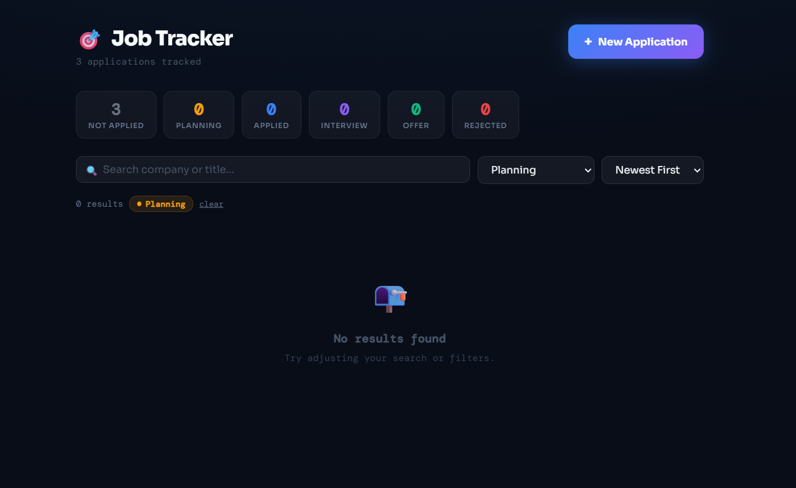

# Job Tracker
A simple, clean web application to track job applications and instantly see their status at a glance.

Built for personal use to manage and monitor job search progress efficiently.



## Live Demo
[**Job Tracker**](https://vercel.com/calara045-oss-projects/calara-job-tracker) - try it now on Vercel

## 🚀 Getting Started

### Prerequisites

- [Node.js](https://nodejs.org/) v18 or higher
- npm v9 or higher

### Installation

```bash
# 1. Clone the repository
git clone https://github.com/calara045-oss/translator-app.git
cd translated-app

# 2. Install dependencies
npm install

# 3. Start the development server
npm run dev
```

Then open [http://localhost:5173](http://localhost:5173) in your browser.
